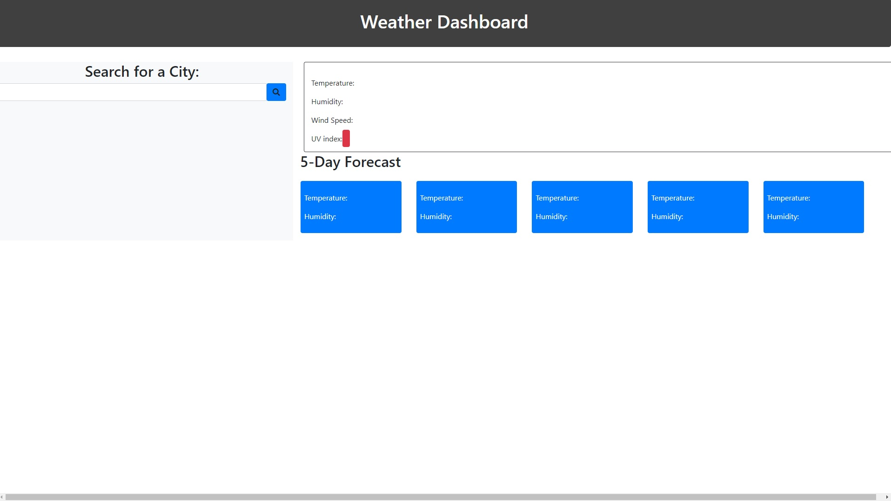

# **Weather Dashboard**

## Table of Contents

* [Description](#description)
* [Requirements](#requirements)
* [Installation](#installation)

## Description
---
In this app you can search for a city or a state to see current weather data and upcoming 5 days weather data. It will save your last search and when you click on it it will direct you to that city so you don't have to search again.


Deployed Project: https://erenozgur98.github.io/weather-dashboard/

---





## Requirements
---
```
GIVEN a weather dashboard with form inputs
WHEN I search for a city
THEN I am presented with current and future conditions for that city and that city is added to the search history
WHEN I view current weather conditions for that city
THEN I am presented with the city name, the date, an icon representation of weather conditions, the temperature, the humidity, the wind speed, and the UV index
WHEN I view the UV index
THEN I am presented with a color that indicates whether the conditions are favorable, moderate, or severe
WHEN I view future weather conditions for that city
THEN I am presented with a 5-day forecast that displays the date, an icon representation of weather conditions, the temperature, and the humidity
WHEN I click on a city in the search history
THEN I am again presented with current and future conditions for that city
```

## Installation
---
No need for any installation for this project. It can be used in the website.

See deployed site here: https://erenozgur98.github.io/weather-dashboard/

See repository here: https://github.com/erenozgur98/weather-dashboard
